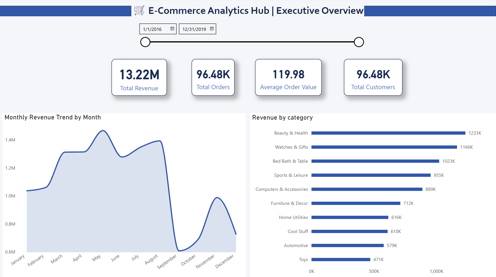
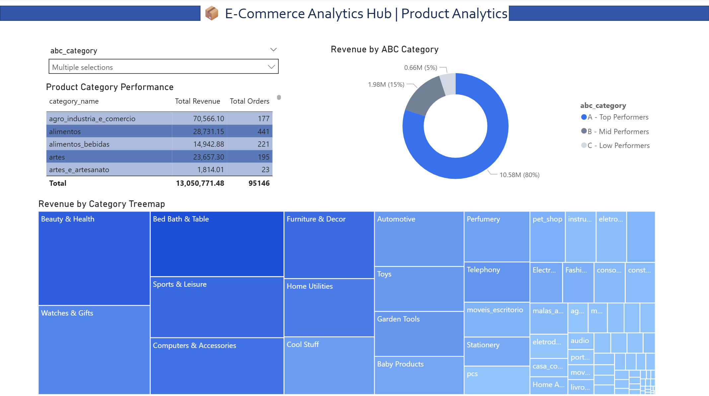
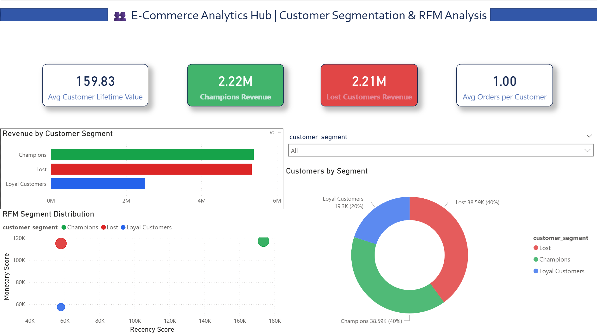

# 🛒 E-Commerce Analytics Hub

> End-to-end analytics platform transforming 100K+ raw e-commerce
> transactions into actionable business insights through automated
> dbt pipelines and interactive Power BI dashboards.

## 🎯 Business Problem

An online retailer struggles with:
- Manual reporting taking 2+ days to produce
- Data scattered across orders, customers, and product systems
- No real-time visibility into revenue, customer health, or product performance
- Leadership unable to answer basic questions like "What's our revenue this week?"

**Solution:** Automated analytics platform reducing reporting time from 2 days to 2 minutes.

## 💡 Solution Architecture
Raw CSVs → Python Loader → DuckDB → dbt Pipeline → Power BI Dashboard
│
┌──────────┼──────────┐
Staging  Intermediate   Marts
(4 models) (3 models)  (4 tables)
Clean     RFM, ABC     Star Schema

## 📊 Key Results

| Metric | Value |
|--------|-------|
| Transactions processed | 110,197 |
| dbt models built | 12 |
| Automated data quality tests | 27 |
| Dashboard pages | 3 |
| Revenue analyzed | €13.22M (2016–2018) |
| Query performance | Star schema optimized |

## 🔍 Business Insights Discovered

**1. Revenue Concentration (ABC Analysis)**
Top 20% of products drive 80% of revenue (€10.5M out of €13.2M) —
classic Pareto pattern. Bottom 12,807 products generate only €661K
combined. Recommendation: discontinue or investigate C-category products.

**2. Customer Retention Crisis**
Average orders per customer = 1.0, meaning almost zero repeat purchases.
This is the single biggest revenue opportunity — a loyalty program
targeting repeat purchases could significantly lift LTV.

**3. Lost Customer Win-Back Opportunity**
Champions and Lost customers generate almost identical revenue
(€5.4M vs €5.3M). These Lost customers were once as valuable as
Champions. A targeted win-back campaign could recover millions in revenue.

**4. Category Diversification**
Beauty & Health leads at €1.23M (9.45% share) but no single category
dominates — healthy revenue diversification with room for
category-specific marketing campaigns.

**5. Seasonal Revenue Pattern**
Sharp revenue dip in September across all years. Inventory and
marketing teams should plan accordingly for Q3 slowdowns.

## 🏗️ Technical Architecture

### dbt Layer Design

| Layer | Models | Purpose |
|-------|--------|---------|
| Staging | 4 models | Clean raw data, cast types, standardize columns |
| Intermediate | 3 models | RFM scoring, ABC classification, order metrics |
| Marts | 4 tables | Star schema optimized for Power BI |

### Star Schema
                dim_customers (99,441 rows)
                RFM segments, CLV, order history
                       │
dim_dates ────────── fct_sales ────────── dim_products
(1,461 rows)        (110,197 rows)        (32,951 rows)
Date spine          Central fact table    ABC classification
2016–2019           Revenue, orders       Category performance

### Data Quality
- 27 automated dbt tests (unique, not_null, relationships, accepted_values)
- Referential integrity checks across all fact-dimension joins
- Business logic validation on RFM scores and ABC categories

## 🔧 Tech Stack

| Layer | Technology |
|-------|-----------|
| Data Storage | DuckDB (local, serverless) |
| Transformation | dbt-core + dbt-duckdb adapter |
| Data Quality | dbt tests (27 automated checks) |
| Visualization | Power BI Desktop |
| Language | Python, SQL |
| Version Control | Git + GitHub |

## 🤖 AI-Augmented Development Workflow

This project was built using an AI-augmented workflow — the way
senior analysts work in 2025:

- **Architectural decisions** — made manually (star schema design,
  layer structure, KPI selection)
- **Business logic** — designed manually (RFM scoring thresholds,
  ABC classification rules, segment definitions)
- **SQL scaffolding** — accelerated with Claude (Anthropic) for
  boilerplate models, reviewed and understood before use
- **Debugging** — AI-assisted for error diagnosis, human-verified fixes
- **Documentation** — AI-assisted drafting, human-edited for accuracy

This approach mirrors how top finance and analytics teams operate —
using AI to eliminate repetitive work while keeping human judgment
at the center of every decision.

## 📈 Dashboard Preview

### Page 1: Executive Overview


### Page 2: Product Analytics


### Page 3: Customer Segmentation & RFM Analysis


## 🚀 How to Run This Project

### Prerequisites
- Python 3.8+
- Mac/Linux/Windows
- Power BI Desktop (for dashboard)

### Setup
```bash
# Clone the repository
git clone https://github.com/himanshu21d/ecommerce_analytics_hub.git
cd ecommerce-analytics-hub

# Create virtual environment
python -m venv venv
source venv/bin/activate  # Mac/Linux
# venv\Scripts\activate   # Windows

# Install dependencies
pip install dbt-duckdb duckdb

# Download dataset
# Get Brazilian E-Commerce dataset from Kaggle:
# https://www.kaggle.com/datasets/olistbr/brazilian-ecommerce
# Place CSV files in data/raw/

# Load data into DuckDB
python load_data.py

# Run full dbt pipeline (models + tests)
dbt build

# Export for Power BI
python3 -c "
import duckdb, os
conn = duckdb.connect('ecommerce.duckdb')
tables = ['fct_sales','dim_customers','dim_products','dim_dates']
os.makedirs('data/exports', exist_ok=True)
for t in tables:
    conn.execute(f'COPY main.{t} TO data/exports/{t}.csv (HEADER, DELIMITER ,)')
    print(f'Exported: {t}.csv')
"
```

### View dbt Lineage
```bash
dbt docs generate
dbt docs serve
# Opens at http://localhost:8080
```

## 📁 Project Structure
ecommerce-analytics-hub/
├── README.md
├── load_data.py                    # DuckDB data loader
├── dbt_project.yml                 # dbt configuration
│
├── data/
│   ├── raw/                        # Original Kaggle CSVs (not in git)
│   └── exports/                    # Power BI ready CSVs
│
├── models/
│   ├── staging/                    # 4 models — clean raw data
│   │   ├── sources.yml
│   │   ├── schema.yml
│   │   ├── stg_orders.sql
│   │   ├── stg_customers.sql
│   │   ├── stg_order_items.sql
│   │   └── stg_order_payments.sql
│   │
│   ├── intermediate/               # 3 models — business logic
│   │   ├── int_order_metrics.sql
│   │   ├── int_customer_metrics.sql  # RFM scoring
│   │   └── int_product_metrics.sql   # ABC classification
│   │
│   └── marts/                      # 4 tables — star schema
│       ├── schema.yml
│       ├── fct_sales.sql
│       ├── dim_customers.sql
│       ├── dim_products.sql
│       └── dim_dates.sql
│
├── seeds/
│   └── category_translations.csv   # EN translations for categories
│
├── docs/
│   └── dbt_lineage.png            # Pipeline lineage diagram
│
├── dashboards/
│   └── screenshots/               # Power BI dashboard screenshots
│
└── analysis/
    └── business_insights.sql      # Advanced SQL queries

## 📧 About & Contact

Built by **Himanshu Dhahana**
M.Sc. Business Administration (Finance & AI/Data Science)
University of Passau, Germany

🔗 [LinkedIn](https://linkedin.com/in/himanshu-d/)

Available for **Werkstudent roles** in:
- FP&A & Financial Controlling
- Corporate Finance & Data Analysis
- Business Intelligence & Analytics

---

⭐ If you find this project useful, please star the repository!
